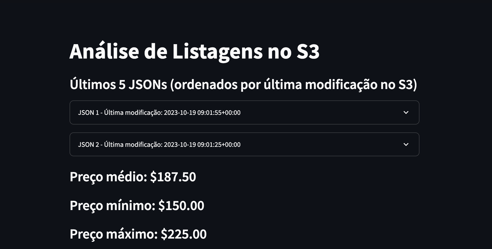
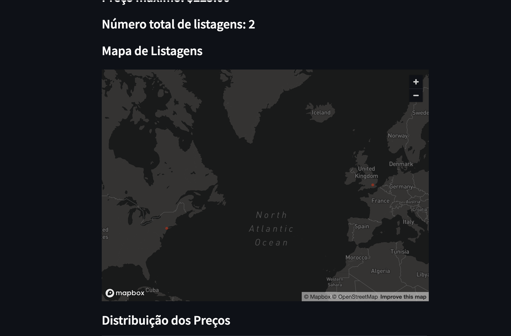
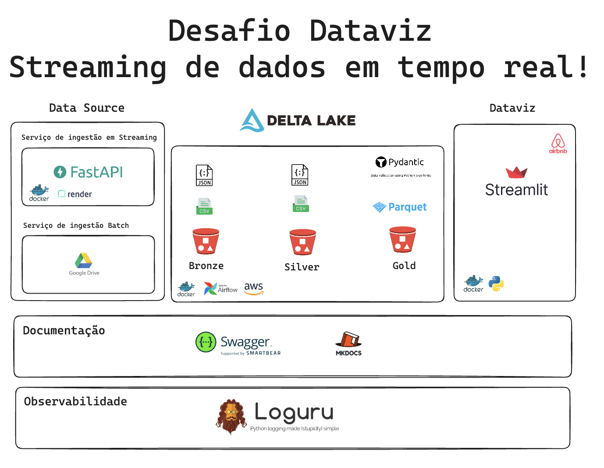
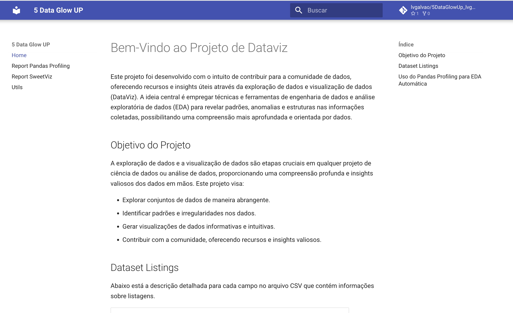
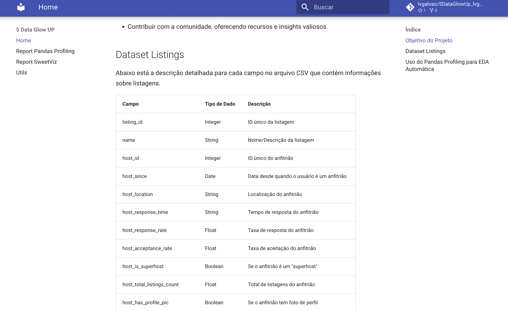
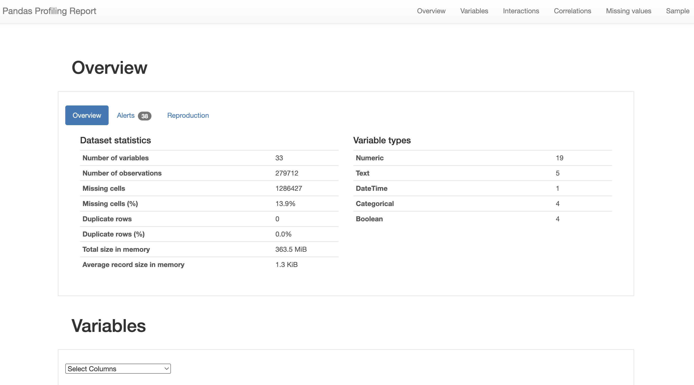
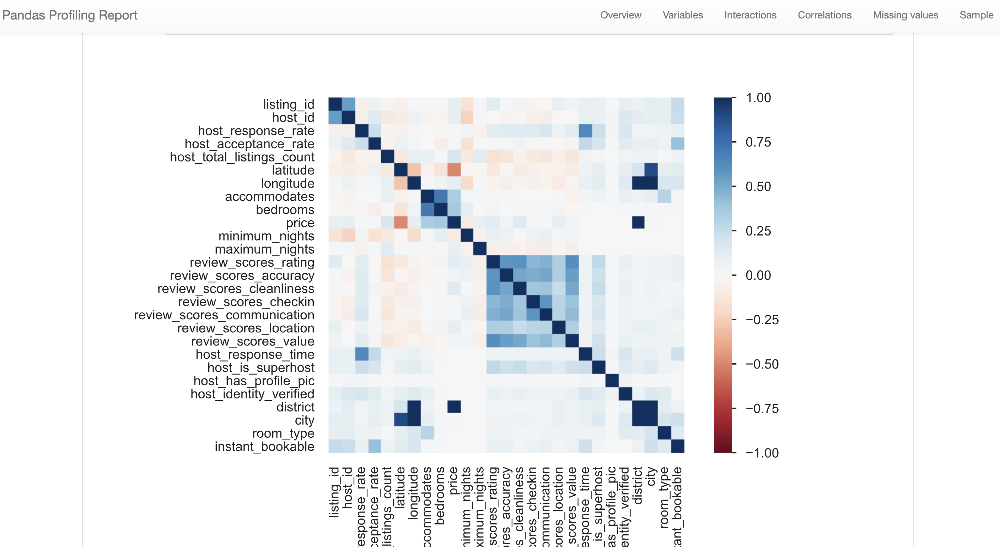
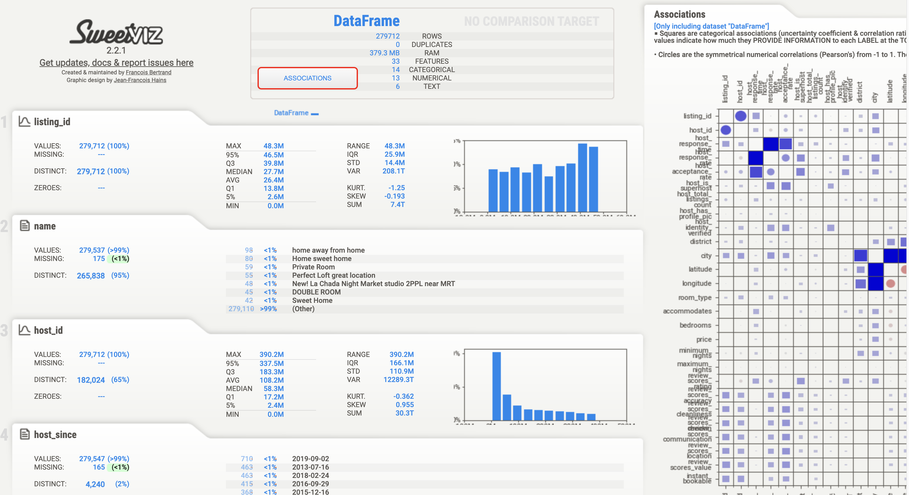

# Projeto de Exploração de Dados e DataViz

## Sobre o Projeto - Acesso à API e Dashboard Interativo

Este projeto foi desenvolvido com o objetivo de participar de um desafio - e de quebra me desenferrjar no dataviz. Todo o conteúdo apresentado aqui possui um caráter estritamente educacional, refletindo uma abordagem simplificada que é ideal para fins de aprendizagem. Portanto, é importante ressaltar que o código, como está, demandaria modificações substanciais para ser aplicado em um contexto de projeto real.

Além disso, todos os serviços são utilizando a camada gratuita. Portanto, é possível que alguns serviços não estejam disponíveis de imediato, normalmente eles precisam de 2/3 minutos para ligarem. Mas espere, vale a pena (ou me mande um pix!)

O objetivo do projeto foi construir um dashboard interativo e atualizado com dados em tempo real, utilizando o Streamlit, que você pode acessar através do seguinte link: [Dashboard Streamlit](https://lvgalvao-5dataglowup-lvgalvaofilho-srcfrontendmain-dyv63r.streamlit.app/). Este dashboard utiliza os dados armazenados em um bucket AWS, consumindo os JSONs gerados pela nossa API. Ele permite uma exploração dinâmica e visual dos dados, proporcionando insights valiosos com a facilidade de interatividade fornecida pelo Streamlit.

Consegue ver as últimas atualizações



Consegue ver plotado no mapa baseado em lat e lon


Este projeto está integrado a uma API disponível em [https://fivedataglowup.onrender.com/](https://fivedataglowup.onrender.com/), que serve os dados processados em um formato que pode ser facilmente consumido por outras aplicações ou serviços.


## EDAs e ETL

Além da API e do Dashboard, o projeto possui uma Análise Exploratória de Dados (EDA) para o conjunto de dados fornecido. Utilizamos ferramentas como [Pandas Profiling](https://lvgalvao.github.io/5DataGlowUp_lvgalvaofilho/reports/pandas_profiling_report.html) e [Sweetviz](https://lvgalvao.github.io/5DataGlowUp_lvgalvaofilho/reports/sweetviz_report.html) para gerar relatórios de EDA automáticos, permitindo insights rápidos e diretos dos dados brutos, além de apresentar visualizações interativas.

Adicionalmente, criamos uma pipeline de processamento de dados robusta que ajuda na limpeza e preparação dos dados, corrigindo problemas de codificação e adicionando métricas de qualidade. Esta pipeline é parte do módulo UTILS, que fornece scripts e funções auxiliares para tratamento de dados.

O repositório serve como um meio de documentar e compartilhar o código, os resultados da análise e o conhecimento adquirido durante o desenvolvimento do projeto.

## Arquitetura do Projeto



## Documentação do projeto



[Mkdocs](https://lvgalvao.github.io/5DataGlowUp_lvgalvaofilho/)

## EDA com Pandas Profile



[Pandas Profiling](https://lvgalvao.github.io/5DataGlowUp_lvgalvaofilho/reports/pandas_profiling_report.html)

## EDA com Sweetviz


[Sweetviz Profiling](https://lvgalvao.github.io/5DataGlowUp_lvgalvaofilho/reports/pandas_profiling_report.html)

## Pipeline de Processamento de Dados

Desenvolvemos uma pipeline automatizada para o processamento dos arquivos CSV encontrados no dataset. Essa pipeline realiza várias tarefas, incluindo a correção de problemas de codificação nos dados e a adição de novas colunas com métricas de qualidade para análise posterior.

Para executar a pipeline, você deve usar os seguintes comandos:

### 1. Clonar o Repositório

Clone o repositório para o seu ambiente local usando o Git.

```sh
git clone git@github.com:lvgalvao/5DataGlowUp_lvgalvaofilho.git
cd 5DataGlowUp_lvgalvaofilho
```

### 2. Instalar as Dependências

Utilize o Poetry para instalar as dependências do projeto.

```sh
poetry install
```

### 3. Rodando a pipeline

```sh
poetry run task process
```

🎉 **Pronto!** Agora você tem os dados tratados

TODO:

- [x] Criar ETL
- [x] Criar um EDA com sweetviz
- [x] Criar um EDA com pandas profile
- [x] Criar um dashboard com streamlit
- [x] Criar API com FastAPI
- [x] Criar estrutura AWS
- [ ] Passar batch para docker usando airflow
- [ ] Integrar batch com streaming
- [ ] Melhorar dashboard
- [ ] Criar um modelo de ML
- [ ] Testes unitários